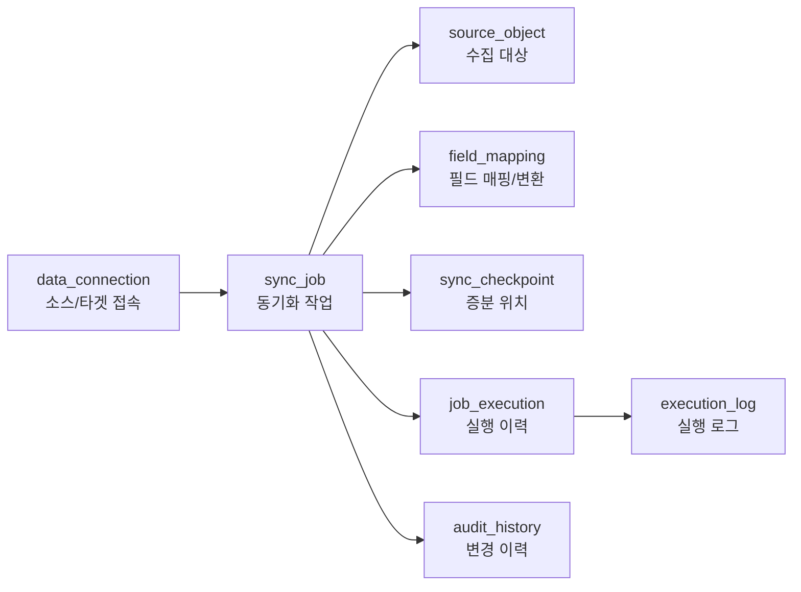

# 데이터 통합 플랫폼 발표용 단순 ERD 설명

함께 볼 ERD 파일: [presentation-simple-data-integration.erd](</C:/Users/kidha/IdeaProjects/mig-erd/presentation-simple-data-integration.erd>)

원본 상세 ERD: [data-integration-platform.erd](</C:/Users/kidha/IdeaProjects/mig-erd/data-integration-platform.erd>)

기획서 요약: [데이터 통합 솔루션 기획서 분석 정리.md](</C:/Users/kidha/IdeaProjects/mig-erd/데이터 통합 솔루션 기획서 분석 정리.md>)

## 1. 단순화 방향

기획서의 전체 기능을 모두 테이블로 분리하면 ERD가 복잡해집니다. 발표와 모델링 학습 목적에서는 “데이터가 어떤 흐름으로 이동하고, 어떤 설정과 이력이 필요한가”를 보여주는 것이 더 중요합니다.

이번 단순 ERD는 다음 기준으로 줄였습니다.

| 상세 모델 요소 | 단순화 판단 | 단순 ERD 반영 |
|---|---|---|
| RDB, 파일, API, Kafka별 접속 테이블 | 접속 정보의 공통 속성이 많으므로 하나로 통합 | `data_connection` |
| MongoDB 타겟 설정 | 소스 접속 정보와 같은 연결 정보 성격 | `data_connection.direction = TARGET` |
| 커넥터 카탈로그 | 개발 확장용 메타데이터라 발표 핵심에서 제외 | `data_connection.connection_type`, `provider`로 표현 |
| 연결 테스트 이력 | 운영 상세 이력으로 분리 가능하지만 핵심 관계는 아님 | `data_connection.last_test_status`로 축약 |
| 변환 규칙, 품질 규칙 | 별도 테이블로 분리하면 학습 난도가 올라감 | `field_mapping.transform_json`으로 통합 |
| MongoDB 인덱스, 적재 후 쿼리 | 고급 적재 옵션 | `sync_job` 또는 `field_mapping`의 부가 설정으로 설명 |
| 실행 단계, DLQ | 장애 분석 고도화 영역 | `job_execution`, `execution_log`로 축약 |
| 알림 채널, 알림 발송 이력 | 운영 확장 영역 | 현재 ERD에서 제외하고 추가 후보로 분류 |
| 사용자 및 권한 | 데이터 동기화 핵심 흐름과 직접 관련이 적음 | 현재 ERD에서 제외하고 추가 후보로 분류 |
| 시스템 구성요소 상태 | 대시보드 조회용 운영 지표 | 실행 이력과 로그로 대체 설명 |

## 2. 단순 ERD의 핵심 구조

단순 ERD는 8개 테이블로 구성됩니다.

| 구분 | 테이블 |
|---|---|
| 접속 정보 | `data_connection` |
| 동기화 설정 | `sync_job`, `source_object`, `field_mapping`, `sync_checkpoint` |
| 실행 및 모니터링 | `job_execution`, `execution_log` |
| 운영 관리 | `audit_history` |

핵심 흐름은 다음과 같습니다.

## 3. 기능별 필요한 테이블

### 커넥션 관리

| 기능 | 필요한 테이블 | 설명 |
|---|---|---|
| 접속 정보 등록 | `data_connection` | RDB, 파일, API, Kafka, MongoDB 접속 정보를 하나의 테이블에 저장 |
| 소스/타겟 구분 | `data_connection` | `direction` 컬럼으로 `SOURCE`, `TARGET`을 구분 |
| 커넥터 종류 구분 | `data_connection` | `connection_type`으로 `RDB`, `FILE`, `API`, `KAFKA`, `MONGODB`를 구분 |
| 공급자별 상세 옵션 | `data_connection` | S3 인증, API Header, Kafka Consumer Group 같은 세부값은 `options_json`에 저장 |
| 연결 테스트 결과 | `data_connection` | 발표용 모델에서는 최근 테스트 결과만 `last_test_status`에 저장 |

### 커넥션 생성 및 동기화 설정

| 기능 | 필요한 테이블 | 설명 |
|---|---|---|
| 동기화 작업 생성 | `sync_job` | 하나의 소스 접속과 하나의 MongoDB 타겟 접속을 연결 |
| 실행 방식 선택 | `sync_job` | `sync_mode`로 전체/증분, `schedule_type`으로 수동/정기/Cron을 표현 |
| 수집 대상 선택 | `source_object` | 테이블, 파일, API Endpoint, Kafka Topic 등 실제 수집 대상을 저장 |
| 선택 컬럼/필드 저장 | `source_object` | 수집할 컬럼이나 필드 목록은 `selected_columns_json`으로 단순화 |
| MongoDB 매핑 | `field_mapping` | 소스 필드를 MongoDB 컬렉션과 문서 경로에 연결 |
| 타입 및 변환 설정 | `field_mapping` | MongoDB 타입, 기본값, 변환 규칙을 함께 저장 |
| 증분 기준 관리 | `sync_checkpoint` | 마지막 성공 cursor 값이나 offset 값을 저장 |

### 실행, 중지, 재시도

| 기능 | 필요한 테이블 | 설명 |
|---|---|---|
| 실행 요청 | `job_execution` | 작업이 실행될 때마다 실행 이력 row 생성 |
| 수동/스케줄/재시도 구분 | `job_execution` | `run_type`으로 실행 유형 구분 |
| 실행 상태 관리 | `job_execution` | `status`로 진행 중, 성공, 실패 상태 표현 |
| 처리 건수 집계 | `job_execution` | 읽은 건수, 적재 건수, 실패 건수를 저장 |
| 상세 로그 | `execution_log` | 실행 중 발생한 INFO/WARN/ERROR/DEBUG 로그 저장 |

### 대시보드 및 모니터링

| 기능 | 필요한 테이블 | 설명 |
|---|---|---|
| 커넥션 수와 상태 | `data_connection`, `sync_job` | 등록된 접속 정보와 작업 상태를 집계 |
| 최근 동기화 상태 | `sync_job`, `job_execution` | 작업별 최근 실행 결과와 실행 시간을 조회 |
| 전송량 추이 | `job_execution` | 시간대별 `read_count`, `written_count` 집계 |
| 오류 현황 | `execution_log` | ERROR 로그를 집계하여 오류 건수와 최근 오류를 표시 |
| 로그 검색 | `execution_log` | 로그 레벨, 메시지, 시간 기준으로 검색 |

### 운영 설정 및 감사

| 기능 | 필요한 테이블 | 설명 |
|---|---|---|
| 변경 이력 | `audit_history` | 작업 생성, 수정, 중지, 실행 요청 같은 운영 이벤트 저장 |
| 변경 전후 비교 | `audit_history` | `before_json`, `after_json`으로 설정 변경 내용을 저장 |

## 4. 테이블별 역할과 키

### `data_connection`

RDB, 파일, API, Kafka, MongoDB 접속 정보를 저장합니다. 소스와 타겟을 같은 테이블에 넣어 구조를 단순화했습니다.

| 컬럼 | 키 역할 | 설명 |
|---|---|---|
| `id` | PK | 접속 정보를 식별하는 기본키 |
| `direction` | 구분 컬럼 | `SOURCE` 또는 `TARGET` |
| `connection_type` | 구분 컬럼 | `RDB`, `FILE`, `API`, `KAFKA`, `MONGODB` |
| `provider` | 구분 컬럼 | MySQL, S3, REST, Kafka 등 세부 공급자 |
| `secret_ref` | 참조 컬럼 | 비밀번호, 토큰 같은 민감정보의 저장 위치 참조 |

### `sync_job`

화면에서 말하는 “커넥션” 또는 “동기화 작업”의 중심 테이블입니다. 어떤 소스에서 어떤 MongoDB 타겟으로, 어떤 주기와 방식으로 동기화할지 정의합니다.

| 컬럼 | 키 역할 | 설명 |
|---|---|---|
| `id` | PK | 작업을 식별하는 기본키 |
| `job_code` | 후보키 | 화면에 표시하기 좋은 작업 코드 |
| `source_connection_id` | FK | 소스 `data_connection.id` 참조 |
| `target_connection_id` | FK | MongoDB 타겟 `data_connection.id` 참조 |
| `sync_mode` | 구분 컬럼 | `FULL`, `INCREMENTAL` |
| `schedule_type` | 구분 컬럼 | `MANUAL`, `INTERVAL`, `CRON` |

### `source_object`

실제 수집 대상을 저장합니다. RDB에서는 테이블, 파일 수집에서는 파일 경로, API에서는 Endpoint, Kafka에서는 Topic에 해당합니다.

| 컬럼 | 키 역할 | 설명 |
|---|---|---|
| `id` | PK | 수집 대상 ID |
| `job_id` | FK | `sync_job.id` 참조 |
| `object_type` | 구분 컬럼 | `TABLE`, `FILE`, `API`, `TOPIC` |
| `object_name` | 일반 컬럼 | 실제 수집 대상 이름 |
| `selected_columns_json` | 설정 컬럼 | 선택 컬럼/필드 목록 |
| `incremental_key` | 설정 컬럼 | 증분 동기화 기준 컬럼 또는 키 |

### `field_mapping`

소스 필드와 MongoDB 문서 필드의 연결 관계를 저장합니다. 변환과 품질 규칙도 발표용 모델에서는 이 테이블에 함께 넣었습니다.

| 컬럼 | 키 역할 | 설명 |
|---|---|---|
| `id` | PK | 매핑 ID |
| `job_id` | FK | `sync_job.id` 참조 |
| `source_field` | 일반 컬럼 | 원본 필드명 |
| `target_collection` | 일반 컬럼 | 적재할 MongoDB 컬렉션 |
| `target_path` | 일반 컬럼 | MongoDB 문서 안의 필드 경로 |
| `target_type` | 일반 컬럼 | string, int32, date 등 MongoDB 타입 |
| `is_key` | 구분 컬럼 | 업서트나 중복 판단에 사용할 키 여부 |
| `transform_json` | 설정 컬럼 | trim, replace, masking, validation 등 변환/검증 규칙 |

### `sync_checkpoint`

증분 동기화의 마지막 성공 위치를 저장합니다. 재실행 시 중복 수집을 줄이고 이어서 처리하기 위한 기준입니다.

| 컬럼 | 키 역할 | 설명 |
|---|---|---|
| `id` | PK | 체크포인트 ID |
| `job_id` | FK | `sync_job.id` 참조 |
| `cursor_key` | 구분 컬럼 | 기준 컬럼명, Kafka partition, 파일 변경 기준 등 |
| `cursor_value` | 상태 컬럼 | 마지막으로 성공 처리한 값 |

### `job_execution`

작업이 실행될 때마다 생성되는 실행 이력입니다. 대시보드와 모니터링의 핵심 데이터가 됩니다.

| 컬럼 | 키 역할 | 설명 |
|---|---|---|
| `id` | PK | 실행 ID |
| `job_id` | FK | `sync_job.id` 참조 |
| `run_type` | 구분 컬럼 | 수동, 스케줄, 재시도 실행 구분 |
| `status` | 상태 컬럼 | 진행 중, 성공, 실패 |
| `read_count` | 집계 컬럼 | 읽은 레코드 수 |
| `written_count` | 집계 컬럼 | MongoDB에 적재한 레코드 수 |
| `failed_count` | 집계 컬럼 | 실패한 레코드 수 |

### `execution_log`

실행 중 발생한 상세 로그를 저장합니다. 오류 분석과 로그 검색 화면에 사용됩니다.

| 컬럼 | 키 역할 | 설명 |
|---|---|---|
| `id` | PK | 로그 ID |
| `execution_id` | FK | `job_execution.id` 참조 |
| `log_level` | 구분 컬럼 | INFO, WARN, ERROR, DEBUG |
| `message` | 일반 컬럼 | 로그 메시지 |
| `context_json` | 상세 컬럼 | 오류 원인, 대상 데이터, 단계 정보 등 |

### `audit_history`

설정 변경과 운영 이벤트를 남깁니다. 실행 로그가 “시스템이 실행 중 남긴 기록”이라면, 감사 이력은 “사용자가 어떤 설정을 바꾸었는지”를 남기는 테이블입니다.

| 컬럼 | 키 역할 | 설명 |
|---|---|---|
| `id` | PK | 이력 ID |
| `job_id` | FK | `sync_job.id` 참조 |
| `actor_name` | 일반 컬럼 | 사용자 ID 또는 시스템 작업자 이름을 문자열로 기록 |
| `event_type` | 구분 컬럼 | CREATE, UPDATE, RUN, STOP 등 |
| `before_json` | 이력 컬럼 | 변경 전 설정 |
| `after_json` | 이력 컬럼 | 변경 후 설정 |

## 5. 테이블 간 관계

| 관계 | 카디널리티 | 의미 |
|---|---|---|
| `data_connection` → `sync_job.source_connection_id` | 1:N | 하나의 소스 접속 정보는 여러 작업에서 재사용 가능 |
| `data_connection` → `sync_job.target_connection_id` | 1:N | 하나의 MongoDB 타겟 접속 정보는 여러 작업에서 재사용 가능 |
| `sync_job` → `source_object` | 1:N | 하나의 작업은 여러 수집 대상을 가질 수 있음 |
| `sync_job` → `field_mapping` | 1:N | 하나의 작업은 여러 필드 매핑을 가질 수 있음 |
| `sync_job` → `sync_checkpoint` | 1:N | 하나의 작업은 대상별 또는 기준별 체크포인트를 가질 수 있음 |
| `sync_job` → `job_execution` | 1:N | 하나의 작업은 여러 번 실행될 수 있음 |
| `job_execution` → `execution_log` | 1:N | 하나의 실행은 여러 로그를 남길 수 있음 |
| `sync_job` → `audit_history` | 1:N | 하나의 작업에 여러 변경 이력이 쌓임 |

## 6. 발표 시 설명 순서

1. 이 플랫폼은 여러 데이터 소스를 MongoDB로 보내는 동기화 시스템이라고 소개합니다.
2. 먼저 `data_connection`이 소스와 타겟 접속 정보를 모두 담는다고 설명합니다.
3. `sync_job`이 소스 접속과 타겟 접속을 연결하는 중심 테이블이라고 설명합니다.
4. `source_object`는 무엇을 읽을지, `field_mapping`은 어떻게 MongoDB 문서로 바꿀지를 담는다고 설명합니다.
5. 증분 동기화는 `sync_checkpoint`가 마지막 처리 위치를 기억하는 방식이라고 설명합니다.
6. 실행 결과는 `job_execution`, 상세 로그는 `execution_log`에 쌓이며 대시보드가 이 데이터를 집계한다고 설명합니다.
7. 설정 변경과 운영 이벤트는 `audit_history`에 기록한다고 마무리합니다.

## 7. 더 단순화하거나 확장할 수 있는 지점

발표 난도를 더 낮추려면 `audit_history`, `sync_checkpoint`를 제외하고 6개 테이블로 설명할 수 있습니다.

반대로 구현 설계에 가깝게 확장하려면 다음 테이블을 다시 분리할 수 있습니다.

| 확장 테이블 | 분리 이유 |
|---|---|
| `connector_catalog` | 커넥터별 입력 항목, 기본 포트, 인증 방식을 동적으로 관리 |
| `connection_test_history` | 연결 테스트 성공/실패 이력을 누적 관리 |
| `transform_rule` | 필드별 복수 변환 규칙을 순서대로 적용 |
| `quality_rule` | 이메일, 전화번호, 도메인 값 검증 규칙을 별도 관리 |
| `dead_letter_record` | 실패 레코드와 재처리 상태를 별도 관리 |

## 8. 추가할 테이블

현재 ERD는 데이터 수집, 변환, 동기화, 실행 이력이라는 핵심 흐름에 집중합니다. 아래 테이블은 발표 후 요구사항이 확장될 때 추가할 수 있습니다.

| 추가 테이블 | 필요한 시점 | 주요 역할과 관계 |
|---|---|---|
| `app_user` | 로그인, 권한 관리, 사용자별 작업 소유권이 필요할 때 | 사용자 계정과 역할을 관리하며 `data_connection`, `sync_job`, `audit_history`와 1:N 관계를 맺음 |
| `alert_rule` | 실패, 지연, 오류 증가에 대한 자동 알림이 필요할 때 | 작업별 알림 조건을 저장하며 `sync_job`과 1:N 관계를 맺음 |

`app_user`를 추가하면 `data_connection.created_by`, `sync_job.created_by`, `audit_history.actor_user_id`를 FK로 둘 수 있습니다. `alert_rule`을 추가하면 알림 채널과 발송 이력은 이후 `alert_channel`, `notification_event`로 더 세분화할 수 있습니다.
